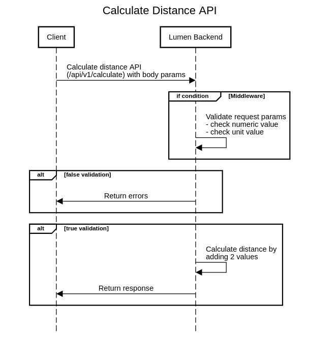

# Distancer App (Developed for Shoparize)

This project is to fullfil the PHP coding challenge provided by Shoparize and its goal was to make a web service that accepts two distances (numbers) and returns the total distance
(sum of both). It depends on Lumen Framework.

# Overview

I started this task with a POC using Laravel Lumen PHP framework to check API workflow. I draw a worflow sequence diagram which descibe what I am going to develop. You can check the following image for reference.

# Lumen PHP Framework

Laravel Lumen is a stunningly fast PHP micro-framework for building web applications with expressive, elegant syntax. We believe development must be an enjoyable, creative experience to be truly fulfilling. Lumen attempts to take the pain out of development by easing common tasks used in the majority of web projects, such as routing, database abstraction, queueing, and caching.
#### Official Documentation

Documentation for the framework can be found on the [Lumen website](https://lumen.laravel.com/docs).
#### License

The Lumen framework is open-sourced software licensed under the [MIT license](https://opensource.org/licenses/MIT).

# Installation

1. Pull the repo or Download the zip file and extract it
2. Run `composer install` command on the root directory to have "vendor" directory.
3. Create .env file from `.env.example` which you can find it on the root directory.
4. Open CMD and check if you can run `php artisan` at the root, It will list artisan commands if run successfully. If It doesn't run successfully, you can run the following command `composer update --no-dev`
5. Run the server by `php -S localhost:8000 -t public` and Check the website application on http://localhost:8000 or you can go and create virtual host to serve it directly with web server and hostname alias.

#### Prerequisites
- PHP >= 7.3
- Composer

#### Production Deployment
- Autoloader Optimization `composer install --optimize-autoloader --no-dev`
- Debug Mode, set `APP_DEBUG` in your .env file with `false`
